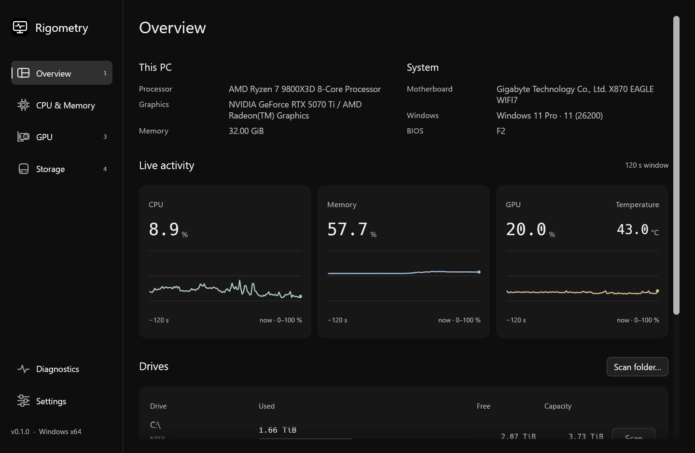
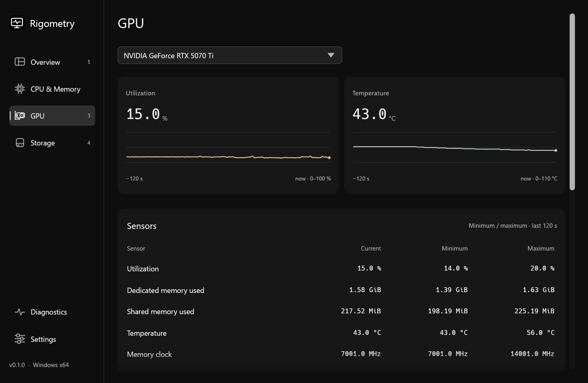
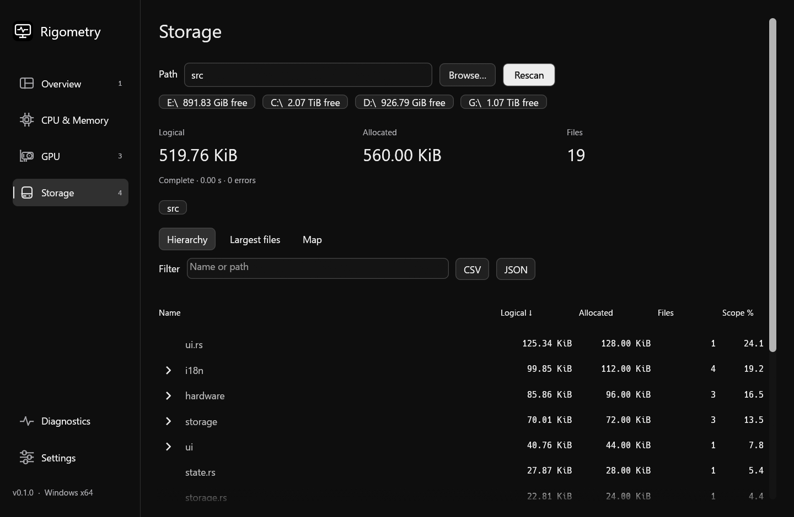
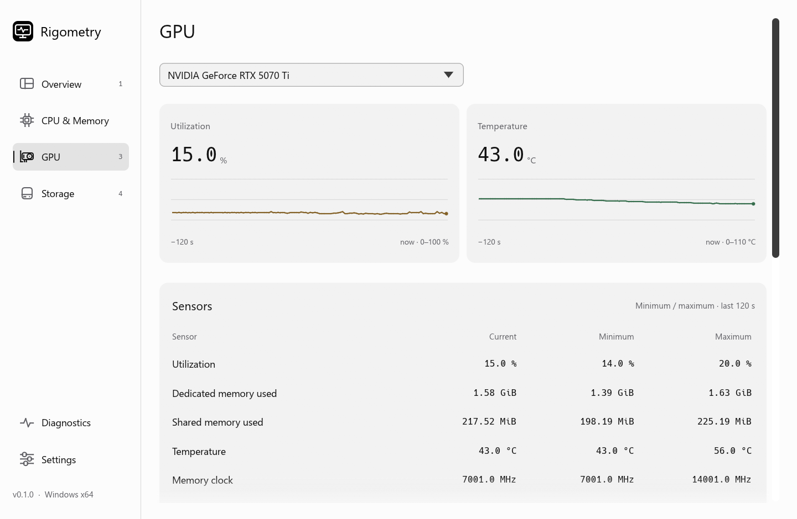

<p align="center">
  
</p>

# Rigometry

Hardware monitoring and storage analysis for **Windows 11 on Intel and AMD x64 PCs**.

[Download](https://github.com/marlonka/Rigometry/releases) · [User guide](docs/usage.md) · [Build from source](docs/development.md) · [Contribute](CONTRIBUTING.md)



## What you can do

- **Watch live activity:** CPU and memory utilization, per-thread CPU activity, GPU utilization and available temperatures, with a 120-second history.
- **Inspect hardware:** processor and cache details, RAM modules, motherboard, BIOS and graphics adapters.
- **Find large files and folders:** browse a sortable hierarchy, filter results, inspect a size map and export CSV or JSON.
- **Check storage accounting:** logical and allocated bytes, hard links, named streams, exclusions and partial results.
- **Use the interface or command line:** dark/light themes, adjustable text size, reduced motion, hardware reports and automated scans.
- **Choose your language:** English, Deutsch, Français or Español. The app follows the Windows display language by default; change it in Settings without restarting.

Hardware queries and scans are read-only. No account, telemetry upload, bundled driver or administrator prompt. Settings are saved locally; reports and exports are created when requested.

<details>
<summary>More screenshots</summary>





</details>

## Compatibility

| Requirement | Support |
| --- | --- |
| Operating system | Windows 11, 64-bit |
| Processor | Intel or AMD x86-64; for example Core, Core Ultra, Ryzen or Threadripper on a compatible Windows 11 system |
| ARM processors | No native ARM64 build. Snapdragon and other Windows-on-ARM systems are not supported; x64 emulation is unverified |
| 32-bit processors / Windows | Not supported |
| Other systems | Windows 10, Windows Server, Linux and macOS are not supported application targets |
| Graphics | Working OpenGL-capable vendor graphics driver for the desktop interface; headless reports do not require a graphics session |

The release uses the baseline `x86_64-pc-windows-msvc` target, with no application-wide AVX, AVX2 or AVX-512 requirement and no build-machine-specific CPU optimization. This is an architecture requirement, **not a claim that every CPU model has been tested**. Physical verification currently covers an AMD Ryzen 7 9800X3D, NVIDIA GeForce RTX 5070 Ti and integrated AMD graphics. Intel systems are intended to work through the same Windows/CPUID interfaces but have not been physically verified.

**Sensor support varies.** CPU temperature, voltage and package power, active RAM timings and SPD/XMP/EXPO reading are not implemented. NVIDIA GPU sensors can use the NVML library supplied by an installed NVIDIA driver. AMD and Intel GPUs use Windows interfaces; temperature, fan and clock readings may be unavailable. The app does not change clocks, fan speeds or firmware.

## Install and run

Open [Releases](https://github.com/marlonka/Rigometry/releases), download the Windows x64 ZIP, extract it and run `Rigometry.exe`. Keep the included license and notice files.

Releases include a SHA-256 checksum beside the ZIP and per-file checksums inside it. The executable is unsigned; a checksum verifies file integrity, not publisher identity. No installer is required.

```powershell
# Build from an x64 Developer PowerShell with Rust and C++ Build Tools installed.
cargo build --release --locked
.\target\release\rigometry.exe
```

## Understanding the readings

- **GiB and MiB are binary units:** 1 GiB = 1,073,741,824 bytes. Exports retain byte counts. [Units and accounting](docs/usage.md#units-and-accounting)
- **Unavailable is different from zero.** Missing sensors, driver failures and denied permissions remain explicit.
- **A scan is not total drive usage.** Filesystem bookkeeping, reparse points and cloud placeholders are excluded. Inaccessible or interrupted results remain partial.

## Development and support

[Development](docs/development.md) · [Architecture](docs/architecture.md) · [Release process](docs/releasing.md) · [Report a bug](https://github.com/marlonka/Rigometry/issues/new/choose) · [Security reporting](SECURITY.md)

Application source and original artwork: [MIT](LICENSE). Dependencies, fonts and runtime components retain their own licenses; see [third-party notices](docs/dependency-notices.md). Developed with AI assistance.
